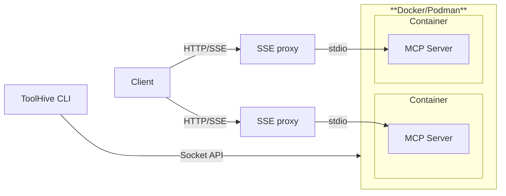

import useBaseUrl from '@docusaurus/useBaseUrl';
import ThemedImage from '@theme/ThemedImage';

import Columns from '@site/src/components/Columns';
import Column from '@site/src/components/Column';

<ThemedImage
  alt='ToolHive logo'
  sources={{
    light: useBaseUrl('/img/toolhive-wordmark-black.svg'),
    dark: useBaseUrl('/img/toolhive-wordmark-white.svg'),
  }}
  title='ToolHive logo'
  height={'80'}
/>

<Columns style={{ marginTop: '2rem' }}>
  <Column style={{ paddingLeft: '0px' }}>
    ## What is ToolHive?

    ToolHive is a lightweight utility designed to simplify the deployment and
    management of Model Context Protocol (MCP) servers. It ensures ease of use,
    consistency, and security by running containers in a locked-down environment
    with minimal permissions.

    Follow the [getting started guide](./quickstart.mdx) to install ToolHive and run
    your first MCP server.

    To learn more about the Model Context Protocol, see our
    [MCP primer](./concepts/mcp-primer.md).

  </Column>
  <Column className='text--center' style={{ maxWidth: '300px' }}>
    
  </Column>
</Columns>

## Architecture overview

ToolHive exposes an SSE proxy to forward requests to MCP servers running in
containers. The proxy communicates with MCP servers via standard input/output
(stdio) or server-sent events (SSE). The ToolHive CLI interacts with Docker or
Podman via the Docker socket API, allowing it to manage containers and their
configurations.

## Why ToolHive?

Deploying MCP servers often involves complex, multi-step processes that can
introduce friction, such as running potentially unsafe commands (e.g., uv or npx
which can execute arbitrary code), manually managing security credentials (e.g.,
storing API tokens in plaintext), and dealing with inconsistent packaging
methods.

ToolHive aims to solve these challenges by running containers in a consistent
and locked-down environment, granting only the minimal permissions required to
run. This significantly reduces the attack surface, improves usability, and
enforces best practices for container security.

## Key features

ToolHive offers the following features to simplify MCP deployment:

- **Simplified deployment**: Deploy MCP servers instantly with a single command
  using Docker containers or directly from package managers via protocol schemes
  (`uvx://`, `npx://`, `go://`). Access a curated registry of verified MCP
  servers that you can discover and run effortlessly.

- **Comprehensive security**: Run containers in isolated containers with
  customizable, fine-grained permissions using JSON profiles. Securely manage
  secrets and configurations using built-in encrypted storage or 1Password
  integration, eliminating plaintext secrets in configuration files.

- **Enterprise readiness**: Implement robust OAuth-based authorization controls
  for enterprise environments that integrate seamlessly with existing
  infrastructure.

- **Kubernetes deployment**: Deploy and manage MCP servers in Kubernetes
  clusters using the ToolHive Operator.

- **Seamless integration**: Configure popular development tools automatically,
  including GitHub Copilot and Cursor, to streamline your workflow with minimal
  setup.

## Additional resources

- [GitHub repository](https://github.com/stacklok/toolhive)
- [Issue tracker](https://github.com/stacklok/toolhive/issues)
- [Discord community](https://discord.gg/stacklok)
