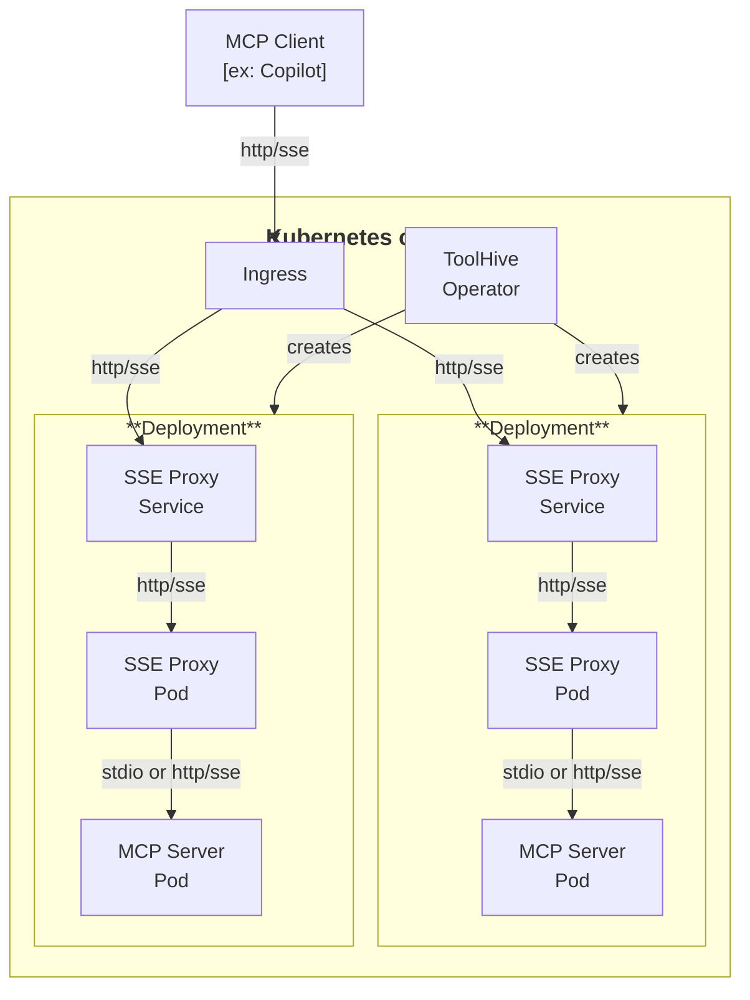

The ToolHive Kubernetes operator manages MCP servers in Kubernetes clusters. It
lets you define MCP servers as Kubernetes resources and automates their
deployment and management.

:::info Experimental

The Kubernetes operator is still under active development and isn't recommended
for production use cases yet. We welcome you to try it out and send feedback.

See the
[ToolHive Operator quickstart tutorial](../tutorials/toolhive-operator.mdx) to
get started quickly using a local kind cluster.

:::

## Overview

The operator introduces a new Custom Resource Definition (CRD) called
`MCPServer` that represents an MCP server in Kubernetes. When you create an
`MCPServer` resource, the operator automatically:

1. Creates a Deployment to run the MCP server
2. Sets up a Service to expose the MCP server
3. Configures the appropriate permissions and settings
4. Manages the lifecycle of the MCP server

## Installation

To install the ToolHive operator in your Kubernetes cluster, use Helm. Helm
simplifies the installation process and lets you manage the operator using Helm
charts.

[Deploy the operator using Helm](./deploy-operator-helm.md)

Once the operator is installed, you can create and manage MCP servers using the
`MCPServer` custom resource.

[Run MCP servers in Kubernetes](./run-mcp-k8s.md)
