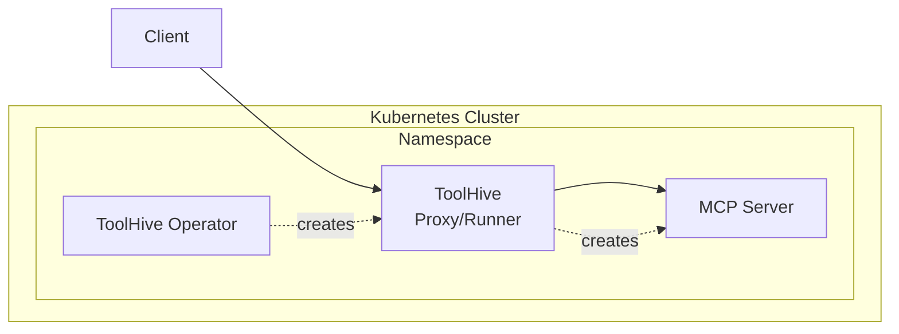
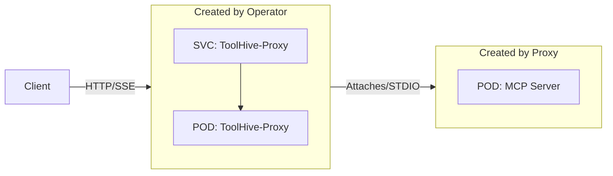
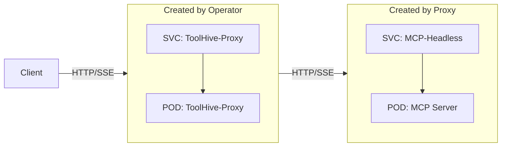

## Prerequisites

- A Kubernetes cluster (v1.19+)
- Permissions to create resources in the cluster
- `kubectl` configured to communicate with your cluster
- The ToolHive operator installed in your cluster (see
  [Deploy the operator using Helm](./deploy-operator-helm.md))

## Overview

The ToolHive operator deploys MCP servers in Kubernetes by creating proxy pods
that manage the actual MCP server containers. Here's how the architecture works:

### High-level architecture

This diagram shows the basic relationship between components. The ToolHive
operator watches for `MCPServer` resources and automatically creates the
necessary infrastructure to run your MCP servers securely within the cluster.



### STDIO transport flow

For MCP servers using STDIO transport, the proxy directly attaches to the MCP
server pod's standard input/output streams.



### SSE transport flow

For MCP servers using Server-Sent Events (SSE) transport, the proxy creates both
a pod and a headless service. This allows direct HTTP/SSE communication between
the proxy and MCP server while maintaining network isolation and service
discovery.



## Create an MCP Server

:::note

Currently, you must create `MCPServer` resources in the same namespace as the
ToolHive operator, which is typically `toolhive-system`. We are working on
support for multi-namespace deployments in the future. Watch
[this issue](https://github.com/stacklok/toolhive/issues/538) for updates.

:::

To create an MCP server, define an `MCPServer` resource and apply it to your
cluster. This minimal example creates the
[`osv` MCP server](https://github.com/StacklokLabs/osv-mcp) which queries the
[Open Source Vulnerability (OSV) database](https://osv.dev/) for vulnerability
information.

```yaml title="my-mcpserver.yaml"
apiVersion: toolhive.stacklok.dev/v1alpha1
kind: MCPServer
metadata:
  name: osv
  namespace: toolhive-system
spec:
  image: ghcr.io/stackloklabs/osv-mcp/server
  transport: sse
  port: 8080
  permissionProfile:
    type: builtin
    name: network
  resources:
    limits:
      cpu: '100m'
      memory: '128Mi'
    requests:
      cpu: '50m'
      memory: '64Mi'
```

Apply the resource:

```bash
kubectl apply -f my-mcpserver.yaml
```

:::info What's happening?

When you apply an `MCPServer` resource, here's what happens:

1. The ToolHive operator running in the `toolhive-system` namespace detects the
   new resource
2. The operator creates a new Deployment containing a ToolHive proxy pod and
   service to handle client connections
3. The proxy creates the actual `MCPServer` pod containing your specified
   container image
4. For STDIO transport, the proxy attaches directly to the pod; for SSE
   transport, a headless service is created for direct pod communication
5. Clients can now connect through the service → proxy → MCP server chain to use
   the tools and resources (note: external clients will need an ingress
   controller or similar mechanism to access the service from outside the
   cluster)

:::

For more examples of `MCPServer` resources, see the
[example MCP server manifests](https://github.com/stacklok/toolhive/tree/main/examples/operator/mcp-servers)
in the ToolHive repo.

## Customize server settings

You can customize the MCP server by adding additional fields to the `MCPServer`
resource. Below are some common configurations.

### Customize the MCP server pod

You can customize the MCP server pod that gets created by the proxy using the
`podTemplateSpec` field. This gives you full control over the pod specification,
allowing you to set security contexts, resource limits, node selectors, and
other pod-level configurations.

The `podTemplateSpec` field follows the standard Kubernetes
[`PodTemplateSpec`](https://kubernetes.io/docs/reference/kubernetes-api/workload-resources/pod-template-v1/#PodTemplateSpec)
format, so you can use any valid pod specification options.

This example sets security contexts and resource limits. It allows the MCP
container to run as root, an unfortunate requirement for the Fetch MCP server
image, while still applying some security restrictions.

```yaml title="my-mcpserver-custom-pod.yaml"
apiVersion: toolhive.stacklok.dev/v1alpha1
kind: MCPServer
metadata:
  name: fetch
  namespace: toolhive-system
spec:
  image: docker.io/mcp/fetch
  transport: stdio
  port: 8080
  permissionProfile:
    type: builtin
    name: network
  podTemplateSpec:
    spec:
      containers:
        - name: mcp # This name must be "mcp"
          securityContext:
            allowPrivilegeEscalation: false
            runAsNonRoot: false # Allows the MCP container to run as root
            runAsUser: 0
            capabilities:
              drop:
                - ALL
          resources: # These resources apply to the MCP container
            limits:
              cpu: '500m'
              memory: '512Mi'
            requests:
              cpu: '100m'
              memory: '128Mi'
      securityContext:
        runAsNonRoot: true # The pod itself can run as a non-root user
        seccompProfile:
          type: RuntimeDefault
  resources: # These resources apply to the proxy container
    limits:
      cpu: '100m'
      memory: '128Mi'
    requests:
      cpu: '50m'
      memory: '64Mi'
```

:::info Container name requirement

When customizing containers in `podTemplateSpec`, you must use `name: mcp` for
the main container. This ensures the proxy can properly manage the MCP server
process.

:::

### Run a server with secrets

For MCP servers that require authentication tokens or other secrets, add the
`secrets` field to the `MCPServer` resource. This example shows how to use a
Kubernetes secret to pass a GitHub personal access token to the `github` MCP
server.

```yaml title="my-mcpserver-with-secrets.yaml"
apiVersion: toolhive.stacklok.dev/v1alpha1
kind: MCPServer
metadata:
  name: github
  namespace: toolhive-system
spec:
  image: ghcr.io/github/github-mcp-server
  transport: stdio
  port: 8081
  permissionProfile:
    type: builtin
    name: network
  secrets:
    - name: github-token
      key: token
      targetEnvName: GITHUB_PERSONAL_ACCESS_TOKEN
```

First, create the secret. Note that the secret must be created in the same
namespace as the MCP server and the key must match the one specified in the
`MCPServer` resource.

```bash
kubectl -n toolhive-system create secret generic github-token --from-literal=token=<YOUR_TOKEN>
```

Apply the MCPServer resource:

```bash
kubectl apply -f my-mcpserver-with-secrets.yaml
```

### Mount a volume

:::warning TODO

TODO: Need info!

:::

## Check MCP server status

To check the status of your MCP servers:

```bash
kubectl -n toolhive-system get mcpservers
```

The status, URL, and age of each MCP server is displayed.

For more details about a specific MCP server:

```bash
kubectl -n toolhive-system describe mcpserver <NAME>
```

## Configuration reference

:::tip QUESTION

TODO: Move to a /reference page? Also could use a way to keep this in sync
automatically.

:::

### MCPServer spec

| Field               | Description                                     | Required | Default |
| ------------------- | ----------------------------------------------- | -------- | ------- |
| `image`             | Container image for the MCP server              | Yes      | -       |
| `transport`         | Transport method (stdio or sse)                 | No       | stdio   |
| `port`              | Port to expose the MCP server on                | No       | 8080    |
| `args`              | Additional arguments to pass to the MCP server  | No       | -       |
| `env`               | Environment variables to set in the container   | No       | -       |
| `volumes`           | Volumes to mount in the container               | No       | -       |
| `resources`         | Resource requirements for the container         | No       | -       |
| `secrets`           | References to secrets to mount in the container | No       | -       |
| `permissionProfile` | Permission profile configuration                | No       | -       |

### Secrets

The `secrets` field has the following parameters:

- `name`: The name of the Kubernetes secret (required)
- `key`: The key in the secret (required)
- `targetEnvName`: The environment variable to be used when setting up the
  secret in the MCP server (optional). If left unspecified, it defaults to the
  key.

### Volumes

The `volumes` field has the following parameters:

:::warning TODO

Need info!

:::

### Permission Profiles

Permission profiles can be configured in two ways:

1. Using a built-in profile:

   ```yaml
   permissionProfile:
     type: builtin
     name: network # or "none"
   ```

2. Using a ConfigMap:

   ```yaml
   permissionProfile:
     type: configmap
     name: my-permission-profile
     key: profile.json
   ```

The ConfigMap should contain a JSON permission profile.

## Next steps

See the [Client compatibility](../reference/client-compatibility.mdx) reference
to learn how to connect to MCP servers using different clients.
